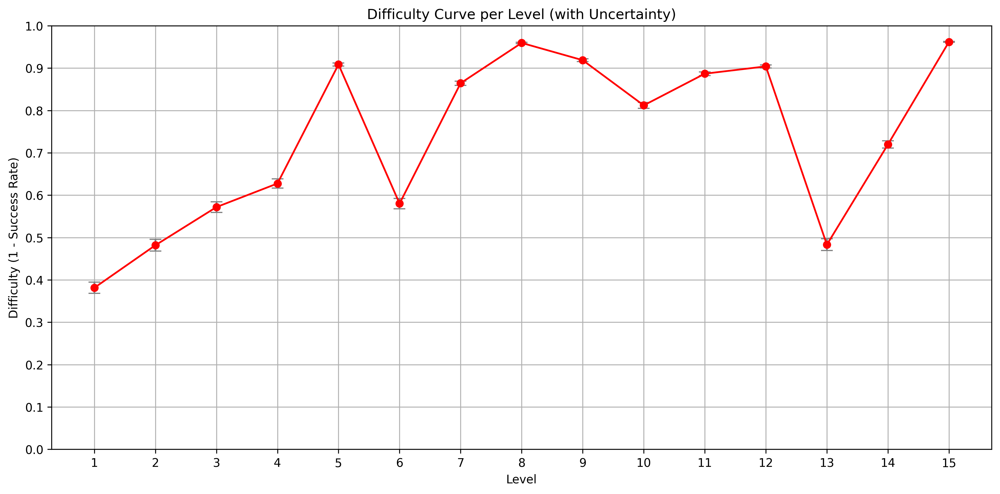
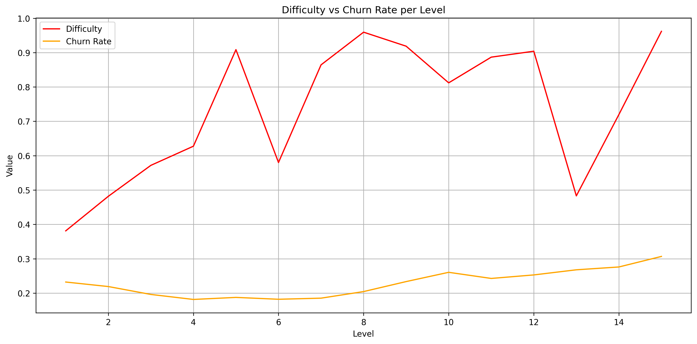

# Candy Crush Difficulty & Churn Analysis

This project analyzes level difficulty and player churn in a Candy Crush-style game using gameplay telemetry data. The goal is to gain actionable insights into level design quality, player engagement, and opportunities for dynamic difficulty adjustment (DDA).

---

## Problem Statement

Millions of new players install the game and play from level 1 onward. However, many players churn early due to inappropriate difficulty — either too easy (boring) or too hard (frustrating).

We aim to:

- Measure the **difficulty** of each level
- Estimate **churn** based on gameplay behavior
- Visualize and analyze **difficulty vs churn** to flag problematic levels

---

## Dataset

### Player-Level Gameplay Data (`candy_crush.csv`)

| Column       | Description                                      |
| ------------ | ------------------------------------------------ |
| player_id    | Unique identifier for each player                |
| level        | Level number played                              |
| dt           | Date of gameplay                                 |
| num_attempts | Number of attempts on the level                  |
| num_success  | Number of times level was successfully completed |

---

## Key Analyses

### 1. Difficulty Curve

We compute difficulty as:

```python
difficulty = 1 - success_rate
success_rate = total_successes / total_attempts

```



### 2. Churn

```python
churned = last_activity_time < (global_latest_time - 7 days)

```


